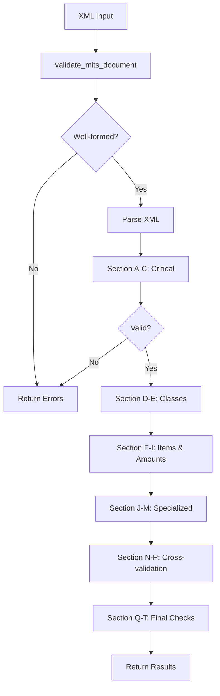

# MITS 5.0 Validator Guide

## Overview

This document provides comprehensive guidance for understanding, using, and extending the MITS 5.0 validator implementation in the `mits-validator-api` service.

## Table of Contents

1. [Introduction](#introduction)
2. [Validation Rules Overview](#validation-rules-overview)
3. [Architecture](#architecture)
4. [Usage Examples](#usage-examples)
5. [Validation Rule Reference](#validation-rule-reference)
6. [Extending the Validator](#extending-the-validator)
7. [Testing](#testing)

## Introduction

The MITS 5.0 (Multifamily Information and Transaction Standard) validator provides comprehensive validation of rental options and fees XML documents. It implements all 110 rules defined in the MITS 5.0 specification, organized into 20 logical sections (A through T).

### Key Features

- **Comprehensive Validation**: Implements all 110 rules from sections A through T
- **Structured Error Reporting**: Clear, actionable error messages with rule IDs and element paths
- **Modular Architecture**: Each section is independently testable and maintainable
- **Performance Optimized**: Short-circuits on critical errors to fail fast
- **Extensible Design**: Easy to add new rules or modify existing ones

## Validation Rules Overview

The validation rules are organized into the following sections:

### Phase 1: Critical Structure (A-C)
- **Section A**: XML Container & Basics (Rules 1-6)
  - Well-formedness, encoding, root element, Property presence
- **Section B**: Fee Placement Scope (Rules 7-10)
  - Valid parent contexts, class/item/amount structure
- **Section C**: Per-Level Identity Hygiene (Rules 11-14)
  - Building, Floorplan, ILS_Unit ID uniqueness

### Phase 2: Class Structure (D-E)
- **Section D**: ChargeOfferClass Structure (Rules 15-20)
  - Code attributes, item presence, uniqueness
- **Section E**: Class Limits (Rules 21-26)
  - MaximumOccurences, MaximumAmount, AppliesTo validation

### Phase 3: Item & Amount Validation (F-I)
- **Section F**: Offer Item Structure (Rules 27-40)
  - InternalCode, Name, Description, Characteristics, occurrences
- **Section G**: Item Characteristics (Rules 42-49)
  - ChargeRequirement, Lifecycle, PaymentFrequency, Refundability
- **Section H**: Amount Basis (Rules 50-56)
  - Explicit, Percentage Of, Within Range, Stepped, Variable, Included
- **Section I**: Amount Blocks (Rules 57-65)
  - Numeric formats, date validation, scheduled pricing

### Phase 4: Specialized Items (J-M)
- **Section J**: AmountPerType & Frequency (Rules 66-69)
  - Per-type enumerations, recurring vs one-time alignment
- **Section K**: PetOfferItem (Rules 70-74)
  - Allowed, breed, weight, deposit requirements
- **Section L**: ParkingOfferItem (Rules 75-78)
  - Structure type, electric, handicapped spaces
- **Section M**: StorageOfferItem (Rules 79-81)
  - Type, unit of measure, dimensions

### Phase 5: Cross-Validation (N-P)
- **Section N**: Intra-class Integrity (Rules 82-89)
  - Code uniqueness, limit application
- **Section O**: Percentage-of References (Rules 90-94)
  - Reference resolution, circular dependency detection
- **Section P**: Included Items (Rules 95-97)
  - Zero-amount enforcement, frequency restrictions

### Phase 6: Final Checks (Q-T)
- **Section Q**: Text & Whitespace Hygiene (Rules 98-102)
  - Required field presence, numeric format, control characters
- **Section R**: Date/Time Consistency (Rules 103-105)
  - Date parsing, window overlap detection
- **Section S**: Frequency vs Basis (Rules 106-108)
  - Coherence between frequency and amount basis
- **Section T**: Duplicates & Collisions (Rules 109-110)
  - Name uniqueness, exact duplicate detection

## Architecture

### Component Structure

```
app/validators/mits/
├── __init__.py              # Package exports
├── base.py                  # Base classes, ValidationResult
├── enums.py                 # Enumeration definitions
├── orchestrator.py          # Main coordinator
├── section_a_xml_basics.py  # Rules 1-6
├── section_b_fee_placement.py # Rules 7-10
├── section_c_identity.py    # Rules 11-14
├── section_d_class_structure.py # Rules 15-20
├── section_e_class_limits.py # Rules 21-26
├── section_f_offer_items.py # Rules 27-40
├── section_g_characteristics.py # Rules 42-49
├── section_h_amount_basis.py # Rules 50-56
├── section_i_amount_blocks.py # Rules 57-65
├── section_j_frequency.py   # Rules 66-69
├── section_k_pet_items.py   # Rules 70-74
├── section_l_parking_items.py # Rules 75-78
├── section_m_storage_items.py # Rules 79-81
├── section_n_o_p_integrity.py # Rules 82-97
└── section_q_r_s_t_final.py  # Rules 98-110
```

### Execution Flow



### Base Classes

#### ValidationResult

Stores validation outcomes with three severity levels:

```python
@dataclass
class ValidationResult:
    valid: bool
    errors: List[ValidationMessage]
    warnings: List[ValidationMessage]
    info: List[ValidationMessage]
```

#### ValidationMessage

Individual validation message:

```python
@dataclass
class ValidationMessage:
    rule_id: str          # e.g., "A.1", "F.27"
    severity: ValidationSeverity  # ERROR, WARNING, INFO
    message: str          # Human-readable description
    element_path: str     # XPath-like location
    details: dict         # Additional context
```

## Usage Examples

### Basic Usage

```python
from app.validators.mits import validate_mits_document

xml_text = """<?xml version="1.0" encoding="UTF-8"?>
<PhysicalProperty>
    <Property IDValue="1">
        <!-- ... -->
    </Property>
</PhysicalProperty>"""

result = validate_mits_document(xml_text)

if result["valid"]:
    print("Document is valid!")
else:
    print("Validation errors:")
    for error in result["errors"]:
        print(f"  - {error}")
```

### Via REST API

```bash
curl -X POST http://localhost:8080/v5.0/validate \
  -H "Content-Type: application/xml" \
  --data-binary @my_mits_file.xml
```

Response:

```json
{
  "valid": true,
  "errors": [],
  "warnings": ["[J.67] Item 'app_fee' uses AmountPerType='Applicant'..."],
  "info": []
}
```

### Programmatic Integration

```python
from app.services.validation_service import validate

# MITS 5.0 validation (default)
result = validate(xml_text, validation_type="mits5")

# Basic XML validation only
result = validate(xml_text, validation_type="basic")
```

## Validation Rule Reference

### Quick Rule Lookup

| Rule ID | Description | Severity |
|---------|-------------|----------|
| A.1 | XML well-formed | ERROR |
| A.2 | UTF-8 encoding | ERROR |
| A.3 | Root is `<PhysicalProperty>` | ERROR |
| A.4 | Contains ≥1 `<Property>` | ERROR |
| A.5 | Property has @IDValue | ERROR |
| A.6 | Property @IDValue unique | ERROR |
| F.27 | Item has InternalCode | ERROR |
| F.28 | InternalCode unique in class | ERROR |
| G.42 | ChargeRequirement required | ERROR |
| G.43 | Conditional validation | ERROR |
| H.56 | Included items no amounts | ERROR |
| T.109 | Name uniqueness | ERROR |
| T.110 | No duplicate items | ERROR |

### Common Error Patterns

#### Missing Required Fields

**Rule F.30**: Item missing `<Name>` element

```xml
<!-- INVALID -->
<ChargeOfferItem InternalCode="fee1">
    <!-- Missing Name -->
    <Description>A fee</Description>
    ...
</ChargeOfferItem>

<!-- VALID -->
<ChargeOfferItem InternalCode="fee1">
    <Name>Application Fee</Name>
    <Description>A fee</Description>
    ...
</ChargeOfferItem>
```

#### Invalid Enumerations

**Rule G.42**: Invalid ChargeRequirement value

```xml
<!-- INVALID -->
<ChargeRequirement>Required</ChargeRequirement>

<!-- VALID -->
<ChargeRequirement>Mandatory</ChargeRequirement>
```

#### Amount Basis Mismatch

**Rule H.51**: Explicit basis requires Amounts

```xml
<!-- INVALID -->
<AmountBasis>Explicit</AmountBasis>
<ChargeOfferAmount>
    <Amounts></Amounts>
    <Percentage>10</Percentage>
</ChargeOfferAmount>

<!-- VALID -->
<AmountBasis>Explicit</AmountBasis>
<ChargeOfferAmount>
    <Amounts>50.00</Amounts>
    <Percentage></Percentage>
</ChargeOfferAmount>
```

#### Percentage-of References

**Rule O.90**: PercentageOfCode must exist (REMOVED - validation no longer enforced)

**Rule O.91**: No self-reference

## Extending the Validator

### Adding a New Rule

1. **Identify the appropriate section** (A-T) for your rule
2. **Update the section validator**:

```python
# In section_x_your_section.py

def _validate_your_new_rule(self, element, ...):
    """Validate Rule X.999: Your rule description."""
    
    if not some_condition:
        self.result.add_error(
            rule_id="X.999",
            message="Clear description of what went wrong",
            element_path=self.get_element_path(element),
            details={"relevant": "context"},
        )
```

3. **Call from the main validate() method**:

```python
def validate(self) -> ValidationResult:
    # ... existing validation ...
    
    for item in items:
        self._validate_your_new_rule(item)
    
    return self.result
```

4. **Add tests**:

```python
# In tests/validators/mits/test_section_x.py

def test_rule_x_999_invalid():
    """Test Rule X.999 catches invalid case."""
    xml = """<PhysicalProperty>...</PhysicalProperty>"""
    
    result = validate_mits_document(xml)
    
    assert not result["valid"]
    assert any("X.999" in err for err in result["errors"])
```

### Adding a New Section

If you need to add an entirely new section (beyond A-T):

1. **Create a new file**: `section_u_your_section.py`

```python
from app.validators.mits.base import BaseValidator, ValidationResult

class SectionUValidator(BaseValidator):
    """Validator for Section U: Your Section Name."""
    
    section_name = "Your Section Name"
    section_id = "U"
    
    def validate(self) -> ValidationResult:
        """Execute Section U validation rules."""
        # Your validation logic here
        return self.result
```

2. **Import in orchestrator.py**:

```python
from app.validators.mits.section_u_your_section import SectionUValidator
```

3. **Add to execution flow**:

```python
# In validate_mits_document()

section_u = SectionUValidator(root)
result.merge(section_u.validate())
```

## Testing

### Running Tests

```bash
# All MITS validator tests
pytest tests/validators/mits/ -v

# Specific test file
pytest tests/validators/mits/test_orchestrator.py -v

# Single test
pytest tests/validators/mits/test_orchestrator.py::TestMITSOrchestrator::test_valid_minimal_document -v

# With coverage
pytest tests/validators/mits/ --cov=app/validators/mits --cov-report=html
```

### Test Structure

Each section should have comprehensive tests:

```python
class TestSectionX:
    """Tests for Section X validator."""
    
    def test_rule_x_1_valid(self):
        """Test Rule X.1 passes for valid input."""
        # ...
    
    def test_rule_x_1_invalid(self):
        """Test Rule X.1 catches invalid input."""
        # ...
    
    @pytest.mark.parametrize("value", ["invalid1", "invalid2"])
    def test_rule_x_2_invalid_values(self, value):
        """Test Rule X.2 with various invalid values."""
        # ...
```

### Using Official Test Files

The repository includes official MITS 5.0 test files:

- `tests/test_full.xml`: Complete MITS 5.0 document
- `tests/test_partial.xml`: Partial document with specific scenarios

Use these for integration testing:

```python
def test_with_official_file():
    with open("tests/test_full.xml") as f:
        xml = f.read()
    
    result = validate_mits_document(xml)
    # Assertions based on expected results
```

## Performance Considerations

### Short-Circuiting

The validator short-circuits on critical errors (Sections A-C) to fail fast:

```python
if not result.valid:
    logger.warning("Critical validation errors, stopping")
    return result.to_dict()
```

### Memory Usage

For large documents (>10MB), consider:

1. Streaming validation for specific sections
2. Batching validation of large item collections
3. Using generators instead of lists where possible

### Optimization Tips

- **Cache item registries**: Build once, reuse across validators
- **Limit depth traversal**: Use specific XPath queries instead of recursive iteration
- **Parallel validation**: Independent sections can be validated in parallel

## Troubleshooting

### Common Issues

#### "Module not found: app.validators.mits"

Ensure the package is properly installed:

```bash
pip install -e .
```

#### "No linter errors but tests fail"

Check that all `__init__.py` files are present in the validator package hierarchy.

#### Performance degradation

Enable debug logging to identify slow validators:

```python
import logging
logging.basicConfig(level=logging.DEBUG)
```

## Additional Resources

- [MITS 5.0 Specification](https://www.naa.org/mits)
- [Project README](README.md)
- [API Documentation](http://localhost:8080/docs) (when service is running)
- [Test Files](tests/)

## Contributing

When contributing new validators or rules:

1. Follow the existing section structure
2. Add comprehensive tests (valid and invalid cases)
3. Update this documentation
4. Ensure all linters pass (`ruff`, `black`, `mypy`)
5. Maintain >90% test coverage

---

**Last Updated**: 2025-10-29  
**Version**: 1.0.0

